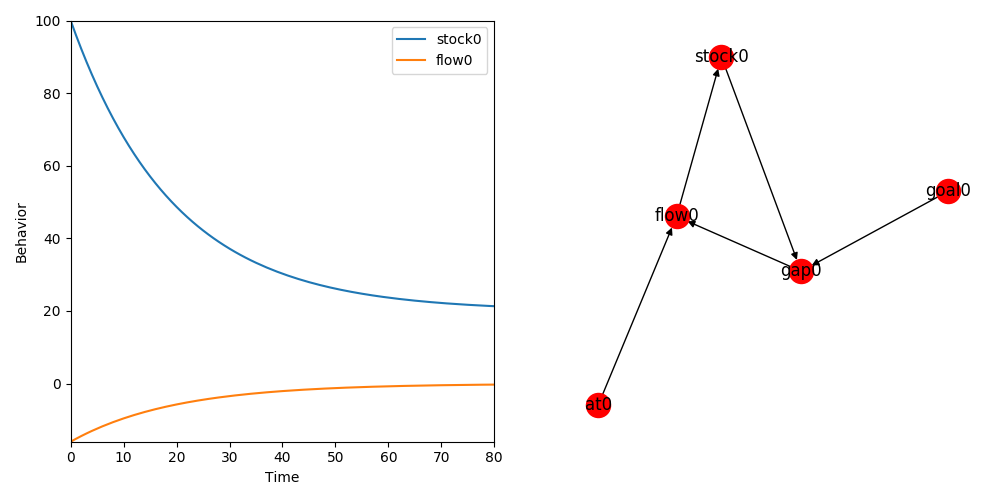

# Graph-SD
Graph-based system dynamics representation and engine

## Why this Repo?
This attempt is a part of the project 'Computer Conceptualization'. 

Since algorithm in this case would be the subject which operates on models, i.e. creating, modifying, and merging them, it is demanded that models are represented in a way that makes such operations easier. Popular standards like XMILE is not very suitable for this purpose. For example, models in XMILE are stored in a tree-like structure (the core of XML), in which the connections are not obviously captures. So are loops.

Moreover, a representation of models for 'automated operation' should also enable 'hot simulation'. This is different from the way in which the python-based SD engine PySD runs simulations. PySD first translates Vensim or XMILE models into a python script, then run this script to get simulation result. In this case, human and machine are actually looking into different representations of the same model.

'Hot simulation' will not take these 2 steps, instead, the model would be simulated directly from the data structure in which it is stored and edited in memory.

## Method

This new approach is inspired first by the similarity between SD models and Graphs (from graph theory), then further developed based on study of Computation Graph used in machine learning frameworks such as TensorFlow or PyTorch. In this perspective, a SD model could be seen as a static graph, where variables are nodes connected to each other and equations are stored in nodes as functions (in programming sense, not mathematical sense).

The most challenging part is how to separate 'the representation of operation' and 'the operation action itself', which is originated from the question 'how to calculate flows'. In traditional approaches, equations are stored as strings and are parsed only when the simulation engine comes to run the model. Strings make sense to human easily, but not as easily to machines. Operation on these equations (such as editing) by algorithm then must be based on 'parsing', which is not very convenient. 

However, if not using strings, the operation will be carried out once the equation is read by the interpreter (for e.g. a + b will either be a string, or the operation of summing up variable 'a' and variable 'b').

The way out of this problem is abstraction. Once we abstract many types of operations into a same form 'operator' and 'parameters', an operation will simply become:
```
operator(param 1, param 2, ..., param N)
```
And this enables us to use recursion to calculate flows' value, because the key to recursion is 'the same function getting called inside its own execution'. In this case, the abstracted 'operation' is the 'same function'.

Please see the source code for more details.

## Result
A simulation run on this 1st order negative feedback test model shows a goal-seeking behavior. 



Parameters used for this model:

```
Initial stock value: 100
Adjustment time: 5
Goal: 20
```

## How to Use it
This implementation works with __Python3__.

The graph package __networkx__ (many thanks to its developers) is used as the backbone for this SD model representation.

__Matplotlib__ is used to draw the simulation result and the model structure itself.

Clone this repo to a local place, and run:

```
pip install networkx
pip install matplotlib
python __init__.py
```

## Discussions
To be continued.