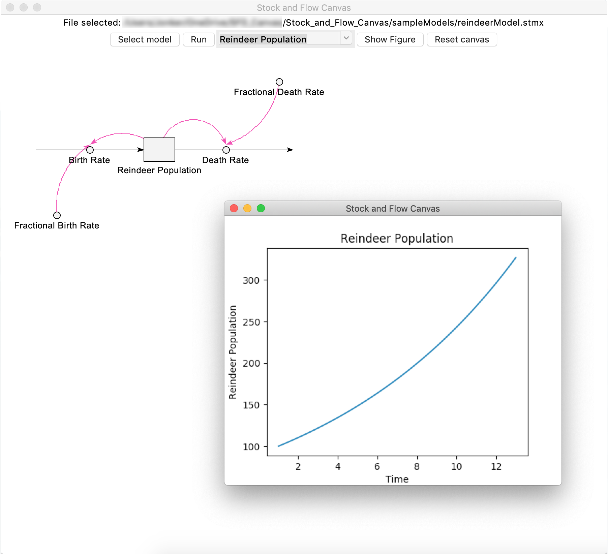

# Stock and Flow Canvas

## Acknowledgement

Simulation of system dynamics models is made possible using the **PySD** project.
https://github.com/JamesPHoughton/pysd

## Introduction

This is a python realization of Stock and Flow Diagram display, based on **Tkinter**.
The intention is to allow users to visually view the model.
Here you can have a quick glance of it:

**Model display:**


**Simulation result display:**



## How to use

**Local-based**

Stock and flow diagrams created by Stella can be displayed using this software.

To display the diagram itself, no additional package other than **Python3** is needed.

To simulate the the model and display the result, **PySD** and **matplotlib** are also needed.

The program could be run from terminal, powershell, or CMD by executing:

```
python3 localMain.py
```

Then you can load the model, simulate and view the outcome in the graphic interface.

**Web-based (Still Trying)**

To deploy the program as a web application, you need **FlexxUI** and **Tornado**.

On linux or macOS, execute:

```
python3 webMain.py --flexx-hostname=0.0.0.0 --flexx-port=8080
```

The line above may be different from the FlexxUI document, but it was proven to be working well.

## Project Structure: PHAPI


**(Problem --> Hypothesis <--> Analysis --> Policy --> Implementation)** (*1)


- **P**roblem
    - Processing multiple types of data
        - Mental data
        - Written data
        - Numerical data
- **H**ypothesis
    - Suggesting possible structures based on similarity between situations
        - Similarity between dynamics patterns
- **A**nalysis
- **P**olicy
    - Beyond scope at this moment.
- **I**mplementation
    - Beyond scope at this moment.

## Change Log

**31 Dec 2018: v0.4.2**

1.  Added narrativeParsing, using NLTK(*2) and StanfordCoreNLP to parse narratives in natural language.
2.  Added narrativeCoding, a first attempt to 'code' narratives.
3.  Added POS_tag_list.txt, an explanation of the acronyms of part of speeches.
4.  Added main, still a blank board, going to be used as the main display and control panel in the future.

**25 Dec 2018: v0.4.1**

1.  Added similarityCalc, a feature to compare similarity between a dynamic pattern and basic behavior patterns. Currently the algorithm uses DTW (Dynamic Time Warping) (Keogh and Ratanamahatana, 2005), but for a better performance, Hidden Markov Model (HMM) will be introduced, as done in BATS (Barlas and Kanar, 2000).

**23 Dec 2018: v0.4.0**

1.  Added stmxGenerator, a set of functions to add components to blank .stmx file.

**15 Dec 2018: v0.3.1**

1.  Canvas in HTML5 is used to draw a first stock for web-based interface.

**23 Nov 2018: v0.3.0**

1.  Starting dev of webApp based on FlexxUI

**22 Nov 2018: v0.2.3**

1.  Able to draw bended flows.

**19 Nov 2018: v0.2.2**

1.  Canvas scrolling feature added.

**18 Nov 2018: v0.2.1**

1.  Able to select variable.
2.  Show result in a standalone window.

**17 Nov 2018: v0.2.0**

1.  Initial interface to PySD. Now able to run the model.
2.  Incorporated graph display using matplotlib to display simulation result of one variable. (Still testing, now only work with reindeerModel.stmx)

**15 Nov 2018: v0.1.1**

1.  Connector display function rewritten. Now connectors could be displayed in almost the identical way Stella is using.
2.  GUI-based model loading function added.

**10 Nov 2018: v0.1.0**
1.  First Commit.

## Remarks
1. PHAPI is a modelling framework introduced by prof. Erling Moxnes at University of Bergen, commonly used in system dynamics-based projects.
2. NLTK is a python-based natural language processing framework.

## Reference
1. Barlas, Y., & Kanar, K. (2000). Structure-oriented behavior tests in model validation. In 18th international conference of the system dynamics society, Bergen, Norway (pp. 33-34).
2. Keogh, E., & Ratanamahatana, C. A. (2005). Exact indexing of dynamic time warping. Knowledge and information systems, 7(3), 358-386.
3. Manning, Christopher D., Mihai Surdeanu, John Bauer, Jenny Finkel, Steven J. Bethard, and David McClosky. 2014. The Stanford CoreNLP Natural Language Processing Toolkit In Proceedings of the 52nd Annual Meeting of the Association for Computational Linguistics: System Demonstrations, pp. 55-60.
