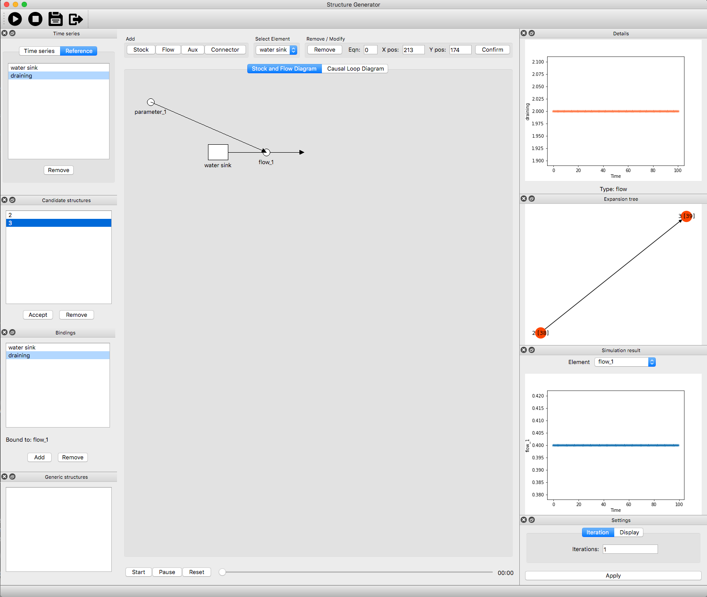

# Stock and Flow in Python

This project contains utilities for System Dynamics in Python.

It contains the following functions:

- Display and simulate simple System Dynamics model using a graph-based engine.
- [Similarity Calculation](StockAndFlowInPython/behaviour_utilities/readme.md): compare behaviors and quantify the similarity.
- Suggestion of possible generic structure for a given reference mode, based on similarity calculation.
- [Stmx Generator](StockAndFlowInPython/stmx_generator/readme.md): store a model in a .stmx file, which can be used by Stella.

---

## A quick glance

**Expanding model structure using time series and informed by generic structures**



## How to use

```
python3 __main__.py
```

## Dependencies

- PyQt5
- grave
- dtw
- networkx
- matplotlib
- numpy
- pandas

## Project Structure: PHAPI

(**Problem --> Hypothesis <--> Analysis** --> Policy --> Implementation) (*1)

- **P**roblem
    - Processing multiple types of data
        - Mental data
        - Written data
        - Numerical data
- **H**ypothesis
    - Suggesting possible structures based on similarity between situations
        - Similarity calculation between dynamics patterns
    - Display the suggested structure
- **A**nalysis
    - Structure Analysis
    - Structure-oriented Behavior Analysis (Barlas and Kanar, 2000)
- **P**olicy
    - Beyond scope at this moment.
- **I**mplementation
    - Beyond scope at this moment.
    
## Change Log

**7 May 2019: v0.8.0**

1. Added utilities for model expansion (Building up by adding components), ready for HCI development

**4 Apr 2019: v0.7.0**

1. Introduced a new floating view
2. Assembled XMILE loading (with simple parsing), SFD display, Graph-based representation, Graph-based simulation, and result display.
3. Structure changed to suit this assembling.

**10 Mar 2019: v0.6.0**

1. Added package Graph-SD, a Graph theory-based SD representation. This is a 'in-memory' data structure, able to store both equation and layout. It comes with an engine for simulation based on recursion.
2. SFD Canvas renamed to renderer. Simulation engine so far is still PySD, since the part for parsing equations hasn't been done. However, in the display part, the graph engine is now used to store the model.
3. Conceptualization Panel now uses graph engine to store, display, and simulate archetypes (generic structures).
4. Project is restructured.

**6 Jan 2019: v0.5.0**

1.  A first version of Conceptualization Panel has been finished, in a very naïve way reproducing the Problem-Hypothesis-Analysis process in human model conceptualization.
2.  Starting an attempt to store all model information in a graph (from Graph Theory), which enables 'hot operation' on models.
3.  Merged sdClasses with globalModel, putting classes and their instances together to avoid import problem.

**4 Jan 2019: v0.4.3**

1.  Updated sdClasses, now capturing not only layout info but also equation.
2.  Each element (stock, flow, aux) is now an instance.
3.  Updated main, adding a simulation feature capable of simulating the tea-cup model.

**31 Dec 2018: v0.4.2**

1.  Added NLP/narrativeParsing, using NLTK(*2) and StanfordCoreNLP to parse narratives in natural language.
2.  Added NLP/narrativeCoding, a first attempt to 'code' narratives.
3.  Added NLP/POS_tag_list.txt, an explanation of the acronyms of part of speeches.
4.  Added main, still a blank board, going to be used as the main display and control panel in the future.

**25 Dec 2018: v0.4.1**

1.  Added similarityCalc, a feature to compare similarity between a dynamic pattern and basic behavior patterns. Currently the algorithm uses DTW (Dynamic Time Warping) (Keogh and Ratanamahatana, 2005), but for a better performance, Hidden Markov Model (HMM) will be introduced, as done in BATS (Barlas and Kanar, 2000).

**23 Dec 2018: v0.4.0**

1.  Added stmxGenerator, a set of functions to confirm components to blank .stmx file.

**15 Dec 2018: v0.3.1**

1.  Canvas in HTML5 is used to draw a first stock for web-based interface.

**23 Nov 2018: v0.3.0**

1.  Starting dev of webApp based on FlexxUI

**22 Nov 2018: v0.2.3**

1.  Able to draw bended flows.

**19 Nov 2018: v0.2.2**

1.  Canvas scrolling feature added.

**18 Nov 2018: v0.2.1**

1.  Able to select variable.
2.  Show result in a standalone window.

**17 Nov 2018: v0.2.0**

1.  Initial interface to PySD. Now able to run the model.
2.  Incorporated graph display using matplotlib to display simulation result of one variable. (Still testing, now only work with reindeerModel.stmx)

**15 Nov 2018: v0.1.1**

1.  Connector display function rewritten. Now connectors could be displayed in almost the identical way Stella is using.
2.  GUI-based model loading function added.

**10 Nov 2018: v0.1.0**
1.  First Commit.

## Remarks
1. PHAPI is a modelling framework introduced by prof. Erling Moxnes at University of Bergen, commonly used in system dynamics-based projects.
2. NLTK is a python-based natural language processing framework.

## Reference
1. Barlas, Y., & Kanar, K. (2000). Structure-oriented behavior tests in model validation. In 18th international conference of the system dynamics society, Bergen, Norway (pp. 33-34).
2. Keogh, E., & Ratanamahatana, C. A. (2005). Exact indexing of dynamic time warping. Knowledge and information systems, 7(3), 358-386.